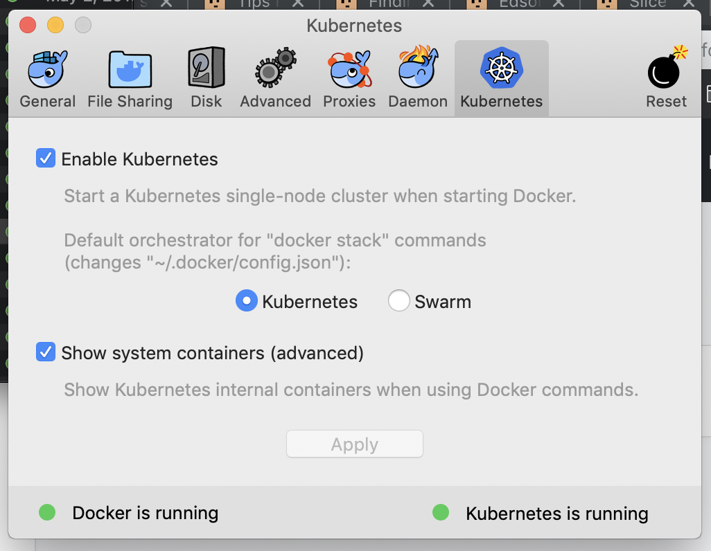
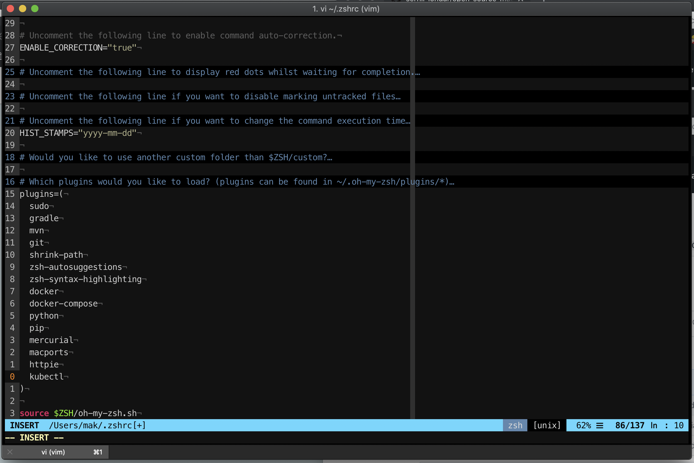

# kubernetes-in-docker-for-mac
Getting started with k8s on Docker for Mac / Windows

## enable kubernetes in Docker for Mac / Windows


## install kubectl auto-completeon (zsh)
I'm using zsh, so all I need to do is add kubectl to plugins section



## testing kubernetes setup
So now we are ready to go with k8s!

Let's run nginx:
```bash
➜  ~ kubectl run --image nginx:alpine web
deployment.apps "web" created
```

Check available deployments:
```bash
➜  ~ kubectl get deployments
NAME      DESIRED   CURRENT   UP-TO-DATE   AVAILABLE   AGE
web       1         1         1            1           2m
```

Replication set:
```bash
➜  ~ kubectl get replicaset
NAME           DESIRED   CURRENT   READY     AGE
web-bbcdd5f4   1         1         1         4m
```

And finally get pods where created:
```bash
➜  ~ kubectl get pod
NAME                 READY     STATUS    RESTARTS   AGE
web-bbcdd5f4-zqq5x   1/1       Running   0          5m
```
