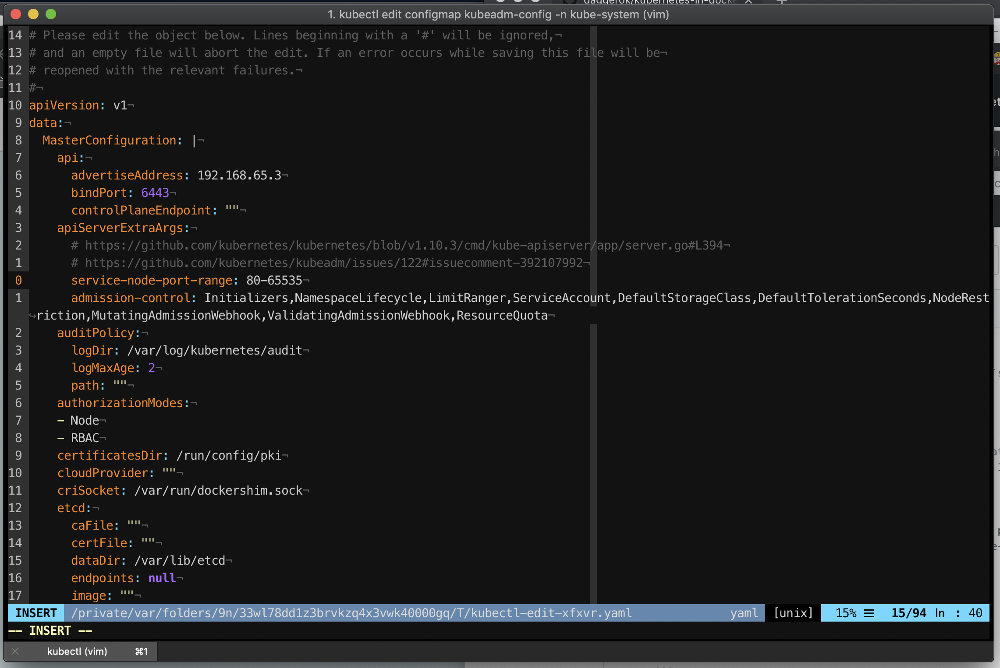

# kubernetes-in-docker
Getting started with k8s on Docker for Mac / Windows

## Basics

### enable kubernetes in Docker for Mac / Windows


### install kubectl auto-completeon (zsh)
I'm using zsh, so all I need to do is add kubectl to plugins section


### testing kubernetes setup
So now we are ready to go with k8s!

Let's run nginx:
```bash
➜  ~ kubectl run --image nginx:alpine web
deployment.apps "web" created
```

Check available deployments:
```bash
➜  ~ kubectl get deployments
NAME      DESIRED   CURRENT   UP-TO-DATE   AVAILABLE   AGE
web       1         1         1            1           2m
```

Replication set:
```bash
➜  ~ kubectl get replicaset
NAME           DESIRED   CURRENT   READY     AGE
web-bbcdd5f4   1         1         1         4m
```

And finally get pods where created:
```bash
➜  ~ kubectl get pod
NAME                 READY     STATUS    RESTARTS   AGE
web-bbcdd5f4-zqq5x   1/1       Running   0          5m
```

### deep dive
Let's get more information about our nginx web deployment

```bash
➜  ~ kubectl describe deployment web
Name:                   web
Namespace:              default
CreationTimestamp:      Sun, 04 Nov 2018 15:14:38 +0200
Labels:                 run=web
Annotations:            deployment.kubernetes.io/revision=1
Selector:               run=web
Replicas:               1 desired | 1 updated | 1 total | 1 available | 0 unavailable
StrategyType:           RollingUpdate
MinReadySeconds:        0
RollingUpdateStrategy:  1 max unavailable, 1 max surge
Pod Template:
  Labels:  run=web
  Containers:
   web:
    Image:        nginx:alpine
    Port:         <none>
    Host Port:    <none>
    Environment:  <none>
    Mounts:       <none>
  Volumes:        <none>
Conditions:
  Type           Status  Reason
  ----           ------  ------
  Available      True    MinimumReplicasAvailable
  Progressing    True    NewReplicaSetAvailable
OldReplicaSets:  <none>
NewReplicaSet:   web-bbcdd5f4 (1/1 replicas created)
Events:
  Type    Reason             Age   From                   Message
  ----    ------             ----  ----                   -------
  Normal  ScalingReplicaSet  7m    deployment-controller  Scaled up replica set web-bbcdd5f4 to 1
```

### expose (access) kubernetes pod (for debug / development use)
Let's test our nginx web app. We can access web deployment via it's pod, so let's do that!

First of all we need to get nginx web pod name
```bash
➜  ~ kubectl get pod
NAME                 READY     STATUS    RESTARTS   AGE
web-bbcdd5f4-zqq5x   1/1       Running   0          9m
```

Now we can forward nginx pod port exposed by default (80) to for example local port 8080 just like so:
```bash
➜  ~ kubectl port-forward web-bbcdd5f4-zqq5x 8080:80
Forwarding from 127.0.0.1:8080 -> 80
Forwarding from [::1]:8080 -> 80
```

Now, let's <a href="http://127.0.0.1:8080/" target="_blank">test</a> if it's working...

With that we make sure that nginx web container is running and handling traffic

## Behind the basics

### expose node port (as random) by using service (for production use)

```bash
➜  ~ kubectl expose deployment web --port 80 --type NodePort
service "web" exposed
```

Let's get services we currently have:

```bash
➜  ~ kubectl get service
NAME         TYPE        CLUSTER-IP       EXTERNAL-IP   PORT(S)        AGE
kubernetes   ClusterIP   10.96.0.1        <none>        443/TCP        1h
web          NodePort    10.110.125.231   <none>        80:30906/TCP   50s
```

As you ca nsee port 80 of nginx web deploymemnt locally exposed on port 30906. Let's test this time if port 30906 is actually working:

```bash
➜  ~ http :30906
HTTP/1.1 200 OK
Accept-Ranges: bytes
Connection: keep-alive
Content-Length: 612
Content-Type: text/html
Date: Sun, 04 Nov 2018 14:18:30 GMT
ETag: "5bb3c541-264"
Last-Modified: Tue, 02 Oct 2018 19:21:37 GMT
Server: nginx/1.15.5

<!DOCTYPE html>
<html>
<head>
<title>Welcome to nginx!</title>
<style>
    body {
        width: 35em;
        margin: 0 auto;
        font-family: Tahoma, Verdana, Arial, sans-serif;
    }
</style>
</head>
<body>
<h1>Welcome to nginx!</h1>
<p>If you see this page, the nginx web server is successfully installed and
working. Further configuration is required.</p>

<p>For online documentation and support please refer to
<a href="http://nginx.org/">nginx.org</a>.<br/>
Commercial support is available at
<a href="http://nginx.com/">nginx.com</a>.</p>

<p><em>Thank you for using nginx.</em></p>
</body>
</html>
```

and it does.

### expose NodePort as concrete target port (minimal is: 30000)

Now I would like to use reverse-engineering principle to get current kubernetes service definition into yaml file:

```bash
➜  ~ kubectl get service web -o yaml > /tmp/web-service.yaml
```

Not let's correct our service definition like so:

```bash
➜  ~ cat /tmp/web-service.yaml
apiVersion: v1
kind: Service
metadata:
  labels:
    run: web
  name: web
  namespace: default
  selfLink: /api/v1/namespaces/default/services/web
spec:
  externalTrafficPolicy: Cluster
  ports:
  - nodePort: 30000
    port: 80
    protocol: TCP
    targetPort: 80
  selector:
    run: web
  sessionAffinity: None
  type: NodePort
status:
  loadBalancer:
    ingress:
    - hostname: localhost
```

Now we can re-create web service:

```bash
➜  ~ kubectl apply -f /tmp/web-service.yaml
Warning: kubectl apply should be used on resource created by either kubectl create --save-config or kubectl apply
service "web" configured
```

Verify service was updated as expected:

```bash
NAME         TYPE        CLUSTER-IP      EXTERNAL-IP   PORT(S)        AGE
kubernetes   ClusterIP   10.96.0.1       <none>        443/TCP        1h
web          NodePort    10.104.17.108   <none>        80:30000/TCP   10m
```

Now we can use out app on http://localhost:30000

## Some advanced stuff

### expose app on previliged port (80)

If you will try set in `/tmp/web-service.yaml` file: `spec.ports[0].nodePort = 8080`, or any other < 30000 value, during kubectl apply you will get an error like this:

```bash
➜  ~ kubectl apply -f /tmp/web-service.yaml
Warning: kubectl apply should be used on resource created by either kubectl create --save-config or kubectl apply
The Service "web" is invalid: spec.ports[0].nodePort: Invalid value: 8080: provided port is not in the valid range. The range of valid ports is 30000-32767
```

TODO: Investigate how we can fix it...

<!--

As you can see, by default, `service-node-port-range` parameter is: `30000-32767`. Bu we can try fix that...
Let's re-configure `kubeadm-config` configmap in `kube-system` namespace:

```bash
kubectl edit configmap kubeadm-config -n kube-system
```

and add `data.apiServerExtraArgs.service-node-port-range: 80-65535` value

```bash
apiVersion: v1¬
data:¬
  MasterConfiguration: |¬
    api:¬
      advertiseAddress: 192.168.65.3¬
      bindPort: 6443¬
      controlPlaneEndpoint: ""¬
    apiServerExtraArgs:¬
      # https://github.com/kubernetes/kubernetes/blob/v1.10.3/cmd/kube-apiserver/app/server.go#L394¬
      # https://github.com/kubernetes/kubeadm/issues/122#issuecomment-392107992¬
      service-node-port-range: 80-65535
```



Now let's update NodePort in `/tmp/web-service.yaml` file to 80:


And re-apply web service:

Done.

Nope, this shit down work.

-->

## app (all.yaml)

Setup:
```bash
➜  kubectl apply -f /tmp/app.yaml
deployment.apps "web" created
service "web-node-port-svc" created
persistentvolumeclaim "db-pvc" created
deployment.apps "postgres" created
service "postgres-clister-ip-svc" created
```

Verify:
```bash
➜  kubectl get -f /tmp/app.yaml
NAME                              TYPE      DATA      AGE
secret/postgres-password-secret   Opaque    1         3s

NAME                           STATUS    VOLUME    CAPACITY   ACCESS MODES   STORAGECLASS   AGE
persistentvolumeclaim/db-pvc   Pending                                       hostpath       3s

NAME                       DESIRED   CURRENT   UP-TO-DATE   AVAILABLE   AGE
deployment.apps/postgres   1         1         1            0           3s

NAME                                 TYPE        CLUSTER-IP      EXTERNAL-IP   PORT(S)          AGE
service/postgres-node-port-dev-svc   NodePort    10.107.237.57   <none>        5432:32345/TCP   3s
service/postgres-clister-ip-svc      ClusterIP   10.110.232.11   <none>        5432/TCP         3s

NAME                  DESIRED   CURRENT   UP-TO-DATE   AVAILABLE   AGE
deployment.apps/web   2         2         2            2           3s

NAME                            TYPE        CLUSTER-IP      EXTERNAL-IP   PORT(S)        AGE
service/web-node-port-dev-svc   NodePort    10.97.202.253   <none>        80:30000/TCP   3s
service/web-cluster-ip-svc      ClusterIP   10.96.135.4     <none>        80/TCP         3s
```
